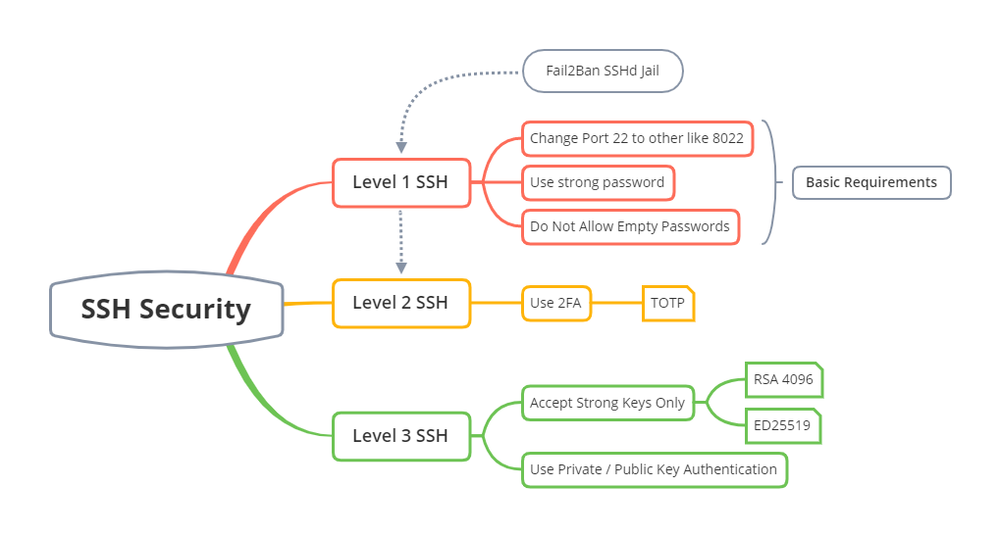

# SSH Configuration

## Windows Terminal SSH Configuration
To configure a Windows Terminal SSH client profile then read the file:  
`01 - Windows Terminal SSH client config.md` 

## SSH Server Configuration
**Level 1 SSH Security** file: `02 - SSH Server Basic Configuration.md`  
**Level 2 SSH Security** file: `03 - SSH Two-Factor Authentication.md`  
**Level 3 SSH Security** file: `04 - SSH Login without password.md`  

## Links - Guidelines
[Mozilla OpenSSH Guidelines](https://infosec.mozilla.org/guidelines/openssh)

[HowToGeek Fail2Ban Guide](https://www.howtogeek.com/675010/how-to-secure-your-linux-computer-with-fail2ban/)
